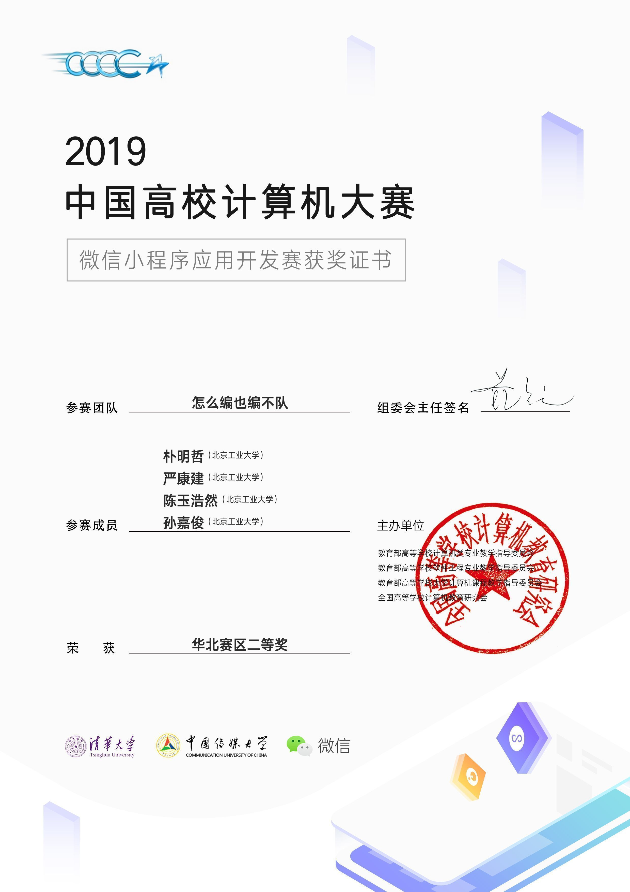

# “拾意”小程序开发文档

2019年07月01日

## 目录

[TOC]

## 1 前言

​	随着人们的生活节奏不断加快，人们更加重视对于碎片化时间的利用，如今各式各样的短视频APP层出不穷，为人们的生活添加了不少乐趣，但是一些乏味的枯燥的视频也随之涌现。

​	因此我们最初的目的是想设计出一款精美图文分享社区平台，让人们能够随手记录和分享自己的生活，在一个自由的空间内表达自己的生活态度。

​	对于程序的命名“拾意”，是因为最初我们对于每一组图文分享的个数设定为“十一”张、阅后即焚的特点。后来为了与我们程序的设计初衷相吻合，也就是记录与分享生活，最终隐喻为“拾意”，意在让用户能够在此拾取生活的意义，当然还有一个原因也是拾意的谐音为十亿，也意味着在这里我们可以看见十亿人海中不同的人分享的生活态度。在这里你可以自由的观看，点赞，评论和转发精美图文，也可以上传属于自己的生活篇章。

​	此报告详细介绍了该软件的开发过程。

<video src="/Users/piaomz/Desktop/shiyigit/拾意演示视频.mp4"></video>

​	

## 2 需求分析

​	本软件的主要意图是构建图文分享社区平台，在类似传统的微博，朋友圈的基础上，添加十一个图文为一组，阅后即焚等功能。因此，我们初步设想了本软件所需要的系统功能，如下用例图所示：

### 2.1 系统功能定义

1. 登录：这是该软件的基本功能，鉴于此软件是在微信小程序平台的基础上开发的，因此登录功能也附带注册功能，登录的同时也要把用户信息录入在系统数据库中。

2. 获取图文：用户以每次每组十一个图文的形式，获取查看他人发布的图文分享，显示在主界面中，再次获取图文后，之前的十一个图文则不能再次出现在该用户的设备中，即阅后即焚。

3. 上传图文：用户能发布自己的图文分享。必须输入一段文字，上传一张图片，打包上传到数据库中，进入待审核状态。

4. 图文互动：用户可以对他人发布的图文分享进行点赞、评论或转发操作。单个图文的点赞数记录在数据库中，用户可以对图文进行评论，也可查看到其他人对该图文的评论，用户可以把该图文转发给朋友或朋友圈。

5. 该用户数据查询与管理：用户可以查看自己的图文发布历史，查看自己发布图文的获赞数和评论的详细内容。用户可以看到自身自从初次登录后的各种数据，如图文被浏览量，图文发布数，获赞数以及被评论数。

6. 用户信息查询：管理员有权查询所有用户信息和用户发布的图文。

7. 审核发布：管理员对上述待审核状态的图文进行审核操作，使图文变为发布状态。

8. 分组整理：管理员对发布状态的图文进行分组（十一个为一组），组形式推送给每个普通用户的待刷新图文中。

9. 删除图文：管理员可删除任何状态的图文。

   

## 3 设计与开发

​	本软件开发时，主要运用了增量式开发的软件开发过程思想。我们在软件开发过程中，先开发获取图文等主要功能模块，再开发用户数据查询等次要功能模块，逐步完善，最终开发出符合需求的软件产品。

​	我们按照以下功能的顺序进行增量开发了，以下将详细介绍开发过程的具体技术实现：

### 3.1 云开发部署

小程序开发本身自带了云开发功能，我们用腾讯给我们的工具构建了数据库，文件结构以及云函数，此部分为传统软件的后端部分。

#### 3.1.1 数据库定义

​	在云端数据库中，我们运用了当下主流的NoSQL数据库，配合远端存储管理，构成了存储图文数据的数据库系统。数据库中主要包括以下集合：

1. Checking集合中保存待审核的图文信息，审核后则放入Word集合中，单个图文记录的定义如下：

   

   ​	_id为当前记录的键，_openid为上传者的唯一识别符，admire为点赞数，groupnum为当前图文的分组编号，imageurl为图片所处云端文件系统的链接，time为上传时间，wenzi为文字内容。

2. Comment集合用来存储所有评论内容，每条记录对应一个评论，定义如下：

   

   _openid为评论者唯一标识符，id对应图文Word集合中的_id，text为评论内容，username为评论者昵称。

3. DzHis集合用来存储点赞记录。

   

   _openid为点赞者的唯一标识符，dzid对应图文Word集合中的_id。

4. Suggestion集合用来存放用户提交的意见反馈。

#### 3.1.2  云文件结构与云函数

​	云上文件结构有以下文件夹，img logo文件夹用来存放软件显示素材文件，picture存放用户上传的图片，start为最开始十一张引导教程图片。

 

​	云函数仅部署了一个，用来获取用户的唯一标识符openid返回给小程序。

### 3.2 UI设计

​	在后端定义完毕之后，我们开始设计用户交互界面设计。我们为了增加小程序交互的趣味性，并没有采用传统的下部导航栏的设计，取而代之的是上拉栏与功能抽屉的设计，更加新颖。

​	主界面上方为标题；中间为显示图文用的swiper组件；下方是一个可以上拉的view，上拉后即可发布自己的图文；点击更多即可弹出功能抽屉，以开启更多的页面。

​	同时我们也为拾意这个创意绘制了很多精美的logo，用在软件的各处UI中充当素材。

### 3.3 获取图文

​	在增量式开发过程中，完成云开发部署和UI设计后，首先完成的前后端交互功能是——获取图文、登录。

​	获取图文功能，用户以每次、每组十一个图文的形式，获取查看他人发布的图文分享并显示在主界面中，点击获取新的图文界面，即可获取未浏览过的新的一组图文，之前浏览过的图文，将不会再次出现（阅后即焚）。

​	实现该功能的过程，如下所示：

​	在用户初次使用拾意小程序时，展示界面展示一组功能介绍图文。

​	用户点击刷新界面时，向数据库发送获取图文请求，数据库根据该用户目前正在浏览的图文组编号，顺序获得下一组图文的访问权限，以此对展示界面的图文进行更新操作。

​	展示界面的SWIPER组件内存有SWIPERLIST数组，数组内逐一存放图文以及其相应的信息。

​	数据库在处理获取图文操作时，首先获取用户正在浏览的图文组编号，并对此编号进行加一操作（图文在数据库中，以十一张为一组，每组有其固定的编号groupnum），数据库将加一过后的编号组数的图文，通过循环逐一赋值给展示界面SWIPER组件中的对应数组，展示界面即可更新至未访问的新的一组图文。

### 3.4 上传图文与审核

​	用户在输入文字的地方使用了弹窗输入的形式输入，选择图片则只能选择一张照片，图片可以删除，但二者之一若有未输入或未选择的情况出现发布按钮禁止使用。

​	实现该功能的过程，如下图所示：

​	在发布按钮可用状态下发布会先将图片上传至云存储的picture/目录下，命名以时间为关键区分以保证命名不重复，上传成功后获取图片的真实链接连同文字内容、点赞数、组号和时间一同记录入云数据库的Words集合中,在记录成功后，将弹发布成功窗，并将文字图片对象初始化操作。

### 3.5 图文互动

​	用户在主界面每张图文下面可以看到三个按钮：点赞、评论、转发。用户可根据自己的喜好对每张图文进行点赞和评论。

​	点击点赞按钮对该图文进行点赞操作；点击评论按钮，可以对该图文进行评论操作、还可以查看其他用户对此图文的评论内容；点击转发按钮即可对该图文进行分享。

​	实现该功能的过程，如下图所示：

​	首先获取当前图文的id。

#### 3.5.1 点赞功能实现

​	当用户点击点赞按钮时，数据库根据此图文的id对数据库中点赞历史记录DzHis集合中，将此id的获赞数进行加一操作，在用户点击刷新界面后，数据库同时对本组图文的信息进行统一更新。

#### 3.5.2 评论功能实现

​	当用户点击评论按钮时，数据库根据此图文的id，在数据库中的comment集合中查找此图文id的评论，并展示。用户评论此图文时，根据此图文id，在comment集合中，增加一条记录。

### 3.6 功能抽屉

​	由3.2UI设计中的截图可见，功能抽屉包括“我的拾意”、“我的发布”、“赞赏支持”、“意见反馈”、“开发管理”功能页面。以下将详细介绍“我的拾意”、“我的发布”两个实现该用户数据查询与管理功能和”意见反馈“的页面实现过程。

#### 3.6.1 我的拾意实现

在我的拾意界面，用户可以查看自己发布的图文的互动信息，如：获赞数、被评论内容。

​	实现该功能的过程，如下图所示：

​	获取获赞数的实现，数据库根据该用户的id，在数据库的点赞记录DzHis集合中，搜索与用户id一致的dzid，并进行统计求和操作。搜索统计结束后，此结果传回展示界面，即该用户发表图文的获赞数。

​	获取用户的所有评论操作的实现，数据库根据该用户的id，在数据库中的评论记录Comment集合中，搜索与用户id一致的username。并将所有搜索结果的text，传回展示界面，即为该用户的所有评论。对此进行统计求和，结果作为该用户发表的评论数。

​	获取用户的所有图文操作的实现，数据库根据该用户的id，在数据库中的图文记录words集合中，搜索与用户id一致的openid。并将所有搜索结果的数量，传回展示界面，即为该用户发表的所有图文数量。

​	获取用户的获得评论数量操作的实现，数据库根据该用户的id，在数据库中的评论记录Comment集合中，搜索与用户id一致的openid。并将所有搜索结果的text，传回展示界面，即为该用户获得的所有评论。对此进行统计求和，结果作为该用户获得的评论数。

#### 3.6.2 我的发布实现

​	我的发布由用户发布的所有图文以及图文包含的全部信息构成（图文的信息包括：发布时间、获赞数，评论数，评论内容等）

​	实现该功能的过程，如下图所示：

​	获取获赞数的实现，数据库根据该用户的id，在数据库的点赞记录DzHis集合中，搜索与用户id一致的dzid，并进行统计求和操作。搜索统计结束后，此结果传回展示界面，即该用户发表图文的获赞数。

​	获取用户的获得评论数量操作的实现，数据库根据该用户的id，在数据库中的评论记录Comment集合中，搜索与用户id一致的openid。并将所有搜索结果的text，传回展示界面，即为该用户获得的所有评论。对此进行统计求和，结果作为该用户获得的评论数。

​	获取用户的所有评论操作的实现，数据库根据该用户的id，在数据库中的评论记录Comment集合中，搜索与用户id一致的username。并将所有搜索结果的text，传回展示界面，即为该用户的所有评论。对此进行统计求和，结果作为该用户发表的评论数。

#### 3.6.3 其他实现

​	其他功能实现较为简单，意见反馈首先由用户填写意见然后点击上传即上传到Suggestion中，其他功能页面均为UI展示，主要是排版设计的实现。

## 4 测试与验证

​	由于我们采用了增量式开发的软件开发过程，因此每完成一两个功能及进行一次集成测试。而在完成单个功能模块编码时，随时进行单元测试。开发的最后阶段我们进行了系统测试和验收测试。以下为开发该软件时的具体测试流程。

### 4.1 单元测试

​	每次增加的增量进行独立开发编码的同时，我们对各部分代码进行单元测试。我们在实际开发中主要把该软件分为上一章提到的6个模块，单元测试的测试方法主要运用依靠源代码的白盒测试方法。即每写一段代码，就进行测试，确保每个模块都能够正常工作。

### 4.2 集成测试

​	在完成获取图文，上传图文功能完成后，我们对这两部分功能和UI、云进行了第一次集成测试，测试过程中我们上传的图文进行手动审核，经验证能够在点击获取图文中获取到新上传的图文，且没有错误出现。

​	在完成图文互动的三个功能（点赞，评论，转发）后，我们进行了第二次集成测试，测试中，点赞操作能够执行，数据已上传数据库，并显示在某些地方；评论操作能够执行，不同用户的评论能够互相显示。结果表明图文互动功能模块可与原先的模块相匹配，无相互的不利影响。

### 4.3 系统测试

​	在开发的最后，我们组织5名用户参与系统黑盒测试，首先每个人发布图文，然后管理员审核分组，接着各用户随意点赞评论，对该软件进行彻底的体验。结果为：该软件系统符合了全部原先确定的软件需求，且体验良好，测试过程中发现少量bug，经过修改，已不影响用户体验。

## 5 总结

​	经过上述需求分析、设计开发、测试验证等环节，最终“拾意”小程序开发基本完成，各部分功能实现符合软件需求，程序BUG较少，体验良好。

本软件参与高校微信小程序应用开发大赛，获得华北赛区二等奖，小程序也已经可以对外开放测试。该软件有不少的优点，也有仍需完善的部分：

### 5.1 软件亮点

1. 创意新颖，以“拾意”的谐音延伸出软件拥有的几个特征，如十一个图文为一组的浏览形式等等。
2. 制作精美，有品牌风格。整体UI设计都为原创且精益求精，美观大方。
3. 软件功能体系完整，实现软件需求的前提下，功能拓展更加人性化，能够达到上线运营的水平。
4. 社区构建内容丰富，可扩展性高，今后能增加用户群体与图文数据的可能性很大，将营造一个和谐、多彩的图文分享社区。

### 5.2 软件进化与维护方向

​	软件还缺乏自动界面化审核管理功能的待开发。用户对自己图文的管理功能仍有些单一，需改进。同时，数据量还不够大，需要更多用户参与测试，分享更多图文，评论。

